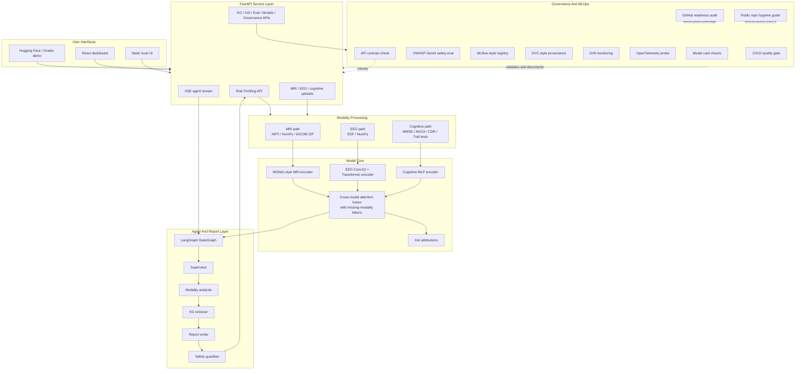
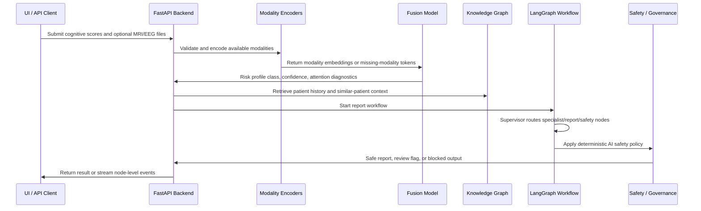

# Architecture Overview

This document gives reviewers a two-minute map of NeuroSight. It is written for
PhD scholarship reviewers, hiring teams, and AI engineers who need to understand
what the project proves without reading every file first.

NeuroSight is a production-shaped research prototype. The architecture is real
and inspectable, while the public data and metrics are intentionally synthetic
and non-clinical.

## System At A Glance



## Request Data Flow



## Layer Responsibilities

| Layer | Responsibility | Main files | What it demonstrates |
|-------|----------------|------------|----------------------|
| UI layer | Presents risk profiling, stream, patient, eval, model, XAI, system, and KG views | `frontend/`, `local_ui/`, `app.py` | Product thinking and frontend/backend integration |
| API layer | Defines service contracts, authentication boundary, upload routes, status routes | `api/main.py`, `neurosight/contracts.py` | FastAPI architecture and typed API design |
| Data layer | Generates synthetic ADNI-like data and defines demo/ADNI-style contracts | `neurosight/data/`, `docs/DATA_DEMO_PIPELINE.md` | Privacy-aware public demo data strategy |
| Modality layer | Processes MRI, EEG, and cognitive inputs into embeddings | `neurosight/models/mri.py`, `neurosight/models/eeg.py`, `neurosight/models/cognitive.py` | Multimodal ML engineering |
| Fusion layer | Combines embeddings and handles missing modalities | `neurosight/models/fusion.py` | Cross-modal attention and robust incomplete-input design |
| Explainability layer | Produces model-behavior diagnostics and interpretation policy | `neurosight/models/xai.py`, `docs/TRUST_EXPLAINABILITY.md` | XAI awareness without clinical overclaiming |
| Agent layer | Converts model/KG context into report text through a state machine | `neurosight/agents/orchestrator.py`, `docs/LANGGRAPH_AGENT_WORKFLOW.md` | LangGraph and LLMOps orchestration |
| KG layer | Tracks temporal patient context and similar-patient retrieval | `knowledge_graph.py` | Graph reasoning concept and patient-history context |
| Governance layer | Enforces model card, AI safety, quality gate, and supply-chain checks | `neurosight/governance/`, `neurosight/security/` | Responsible AI and CI/CD discipline |
| MLOps layer | Tracks registry, provenance, ONNX export, drift, and observability | `scripts/`, `docs/MLFLOW_REGISTRY.md`, `docs/DVC_PROVENANCE.md` | Production-readiness concepts |

## Component To Skill Map

| Component | Technology | File path | Skill shown |
|-----------|------------|-----------|-------------|
| MRI encoder | PyTorch, MONAI-style 3D model design | `neurosight/models/mri.py` | Neuroimaging model architecture |
| EEG encoder | PyTorch Conv1D / Transformer | `neurosight/models/eeg.py` | Time-series deep learning |
| Cognitive encoder | PyTorch MLP | `neurosight/models/cognitive.py` | Tabular clinical-feature modeling |
| Fusion model | Cross-modal attention | `neurosight/models/fusion.py` | Multimodal representation learning |
| XAI engine | GradCAM-style, attention, feature attribution concepts | `neurosight/models/xai.py` | Explainability and interpretation boundaries |
| Risk Profiling API | FastAPI | `api/main.py` | Backend service design |
| API contract check | FastAPI TestClient | `scripts/api_contract_check.py` | Route, SSE, auth, and middleware verification |
| GitHub readiness audit | Local repository scanner | `scripts/github_readiness.py` | Portfolio hygiene, disclosure, secret/artifact, and license checks |
| Public repository guide | Publication policy | `docs/PUBLIC_REPOSITORY_GUIDE.md` | What stays public, what stays local, and how to phrase AI claims |
| Agent workflow | LangGraph StateGraph | `neurosight/agents/orchestrator.py` | Agent orchestration and state routing |
| Workflow trace | Deterministic trace script | `scripts/langgraph_workflow.py` | Reproducible agent execution evidence |
| Model registry | JSON registry and MLflow bridge | `scripts/mlflow_registry.py` | Model lifecycle and promotion semantics |
| Data provenance | DVC-style manifest | `scripts/dvc_provenance.py` | Dataset/model artifact traceability |
| FHIR export | FHIR R4 mapping | `scripts/fhir_export.py` | Healthcare interoperability |
| DICOM manifest | DICOM/DICOMweb awareness | `scripts/dicomweb_manifest.py` | Medical imaging interoperability |
| Observability | OpenTelemetry probe | `scripts/otel_probe.py` | Traceability and service diagnostics |
| Drift monitor | PSI/KS monitoring | `scripts/drift_monitor.py` | MLOps monitoring |
| ONNX export | ONNX Runtime pathway | `scripts/onnx_export.py` | Model deployment portability |
| AI safety | OWASP GenAI mapping | `scripts/ai_safety_eval.py` | LLM safety and red-team thinking |
| Quality gate | CI/CD readiness report | `scripts/quality_gate.py` | Release discipline and repo governance |

## Agent Workflow Shape

The LangGraph workflow is intentionally bounded and explainable:

```text
supervisor
  -> mri_analyst
  -> eeg_analyst
  -> cognitive_analyst
  -> kg_retriever
  -> report_writer
  -> safety_guardian
  -> end
```

This is not meant to be a free-form autonomous clinician. It is a controlled
state machine that demonstrates agent routing, report generation, KG context,
streaming events, and deterministic safety checks.

## Runtime Modes

| Mode | Purpose | Claim allowed |
|------|---------|---------------|
| Public demo | GitHub-safe demo using synthetic/mock data | Engineering demonstration only |
| Local research | Local backend and frontend with generated demo data | Reproducible prototype behavior |
| Private authorized research | Future use with approved ADNI/OASIS-style data outside the repo | Research evaluation only after validation |
| Clinical production | Out of scope | No claim |

## Why The Architecture Is Defensible

The project is defensible because it separates:

- implemented engineering from clinical validation,
- public synthetic data from private real cohorts,
- model diagnostics from clinical evidence,
- agent orchestration from autonomous clinical reasoning,
- MLOps readiness concepts from production healthcare deployment.

That separation is the central architecture principle of NeuroSight.

## Known Architecture Limits

- Public evaluation is synthetic and cognitive-centered.
- MRI/EEG branches are architecture and ingestion demonstrations until real
  checkpoints and validated preprocessing are added.
- LangGraph execution is not yet persisted with durable checkpoints.
- KG memory is demo-scale and not backed by a production graph database.
- Observability is probe/documentation oriented rather than a full deployed
  telemetry stack.
- The public demo security model is not a production healthcare auth model.

## Reviewer Reading Path

For a fast review:

1. Read `PROJECT_STATUS.md`.
2. Read this architecture overview.
3. Read `docs/IMPLEMENTED_VS_PLANNED.md`.
4. Run `python3 scripts/api_contract_check.py --strict`.
5. Run `python3 scripts/github_readiness.py --strict`.
6. Run `python3 scripts/quality_gate.py --strict`.
7. Inspect `MODEL_CARD.md` and `docs/AI_SAFETY_OWASP_GENAI.md`.

This path gives the clearest view of what the project proves and what it does
not claim.
