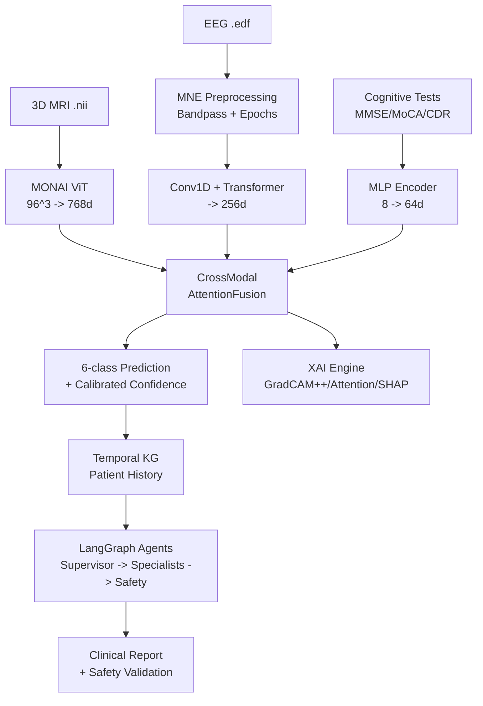
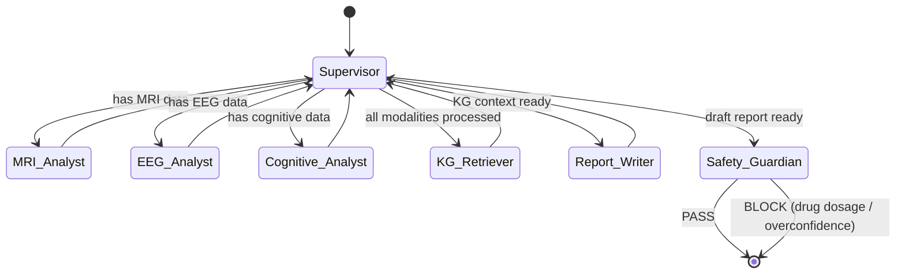
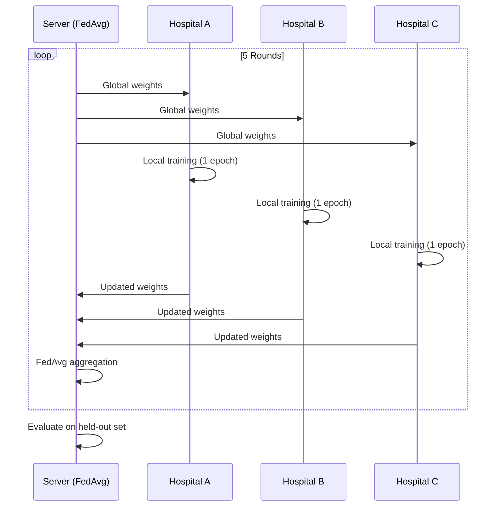
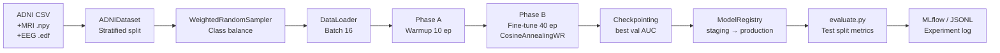

# NeuroSight Architecture

For a reviewer-friendly architecture walkthrough, see
[`ARCHITECTURE_OVERVIEW.md`](ARCHITECTURE_OVERVIEW.md). This file keeps the
original compact diagrams for quick reference.

## Agent State Machine

## Federated Learning

## Data Flow

